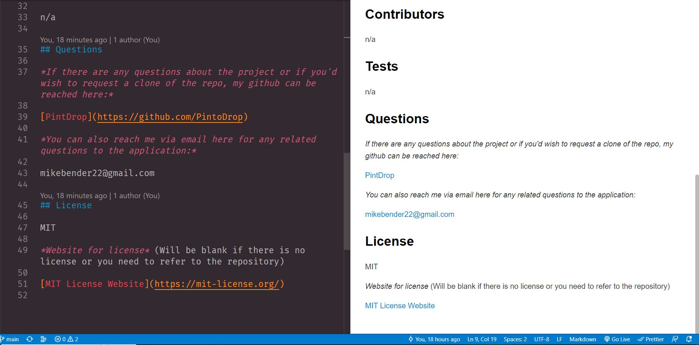

# Read Me Generator

## *Table Of Contents*

1. [Description](#description)
2. [Usage](#usage)
3. [License](#license)
4. [Criteria For Assignment](#criteria-for-assignment)
5. [Repo Link](#repository-link)
6. [Example of Read Me](#example)
7. [Walkthrough Video](#walk-through-video)
8. [Screen Shots](#screen-shots)

## Description

For this assignment I was tasked with creating a README generator to make it faster for the developer to create a well thought out read me they can use on their applications. The user will be able to input unqie information for their project and have it generated into a read me document. The user will be asked a series of questions to input for the information needed in a read me document.

## Usage

The user will be able to use this application to enter in some information about their application. After they have entered this information they will be presented with a read me that they can use in their project. This will help both the developer and the user to better understand the application. This will help the developer save time with formatting a read me while still being able to input vital information on their applications.

## License

Please refer to the LICENSE in the repo.

## Criteria-for-assignment

GIVEN a command-line application that accepts user input

**WHEN I am prompted for information about my application repository**
*THEN a high-quality, professional README.md is generated with the title of my project and sections entitled Description, Table of Contents, Installation, Usage, License, Contributing, Tests, and Questions*

**WHEN I enter my project title**
*THEN this is displayed as the title of the README*

**WHEN I enter a description, installation instructions, usage information, contribution guidelines, and test instructions**
*THEN this information is added to the sections of the README entitled Description, Installation, Usage, Contributing, and Tests*

**WHEN I choose a license for my application from a list of options**
*THEN a badge for that license is added near the top of the README and a notice is added to the section of the README entitled License that explains which license the application is covered under*

**WHEN I enter my GitHub username**
*THEN this is added to the section of the README entitled Questions, with a link to my GitHub profile*

**WHEN I enter my email address**
*THEN this is added to the section of the README entitled Questions, with instructions on how to reach me with additional questions*

**WHEN I click on the links in the Table of Contents**
*THEN I am taken to the corresponding section of the README*

## Repository-Link

[Github](https://github.com/PintoDrop/enigma)

## Example

[Example READ ME](https://github.com/PintoDrop/enigma/blob/main/README-EX.md)

## Walk-Through-Video

[Read Me Generator Walkthrough]()

## Screen-Shots

